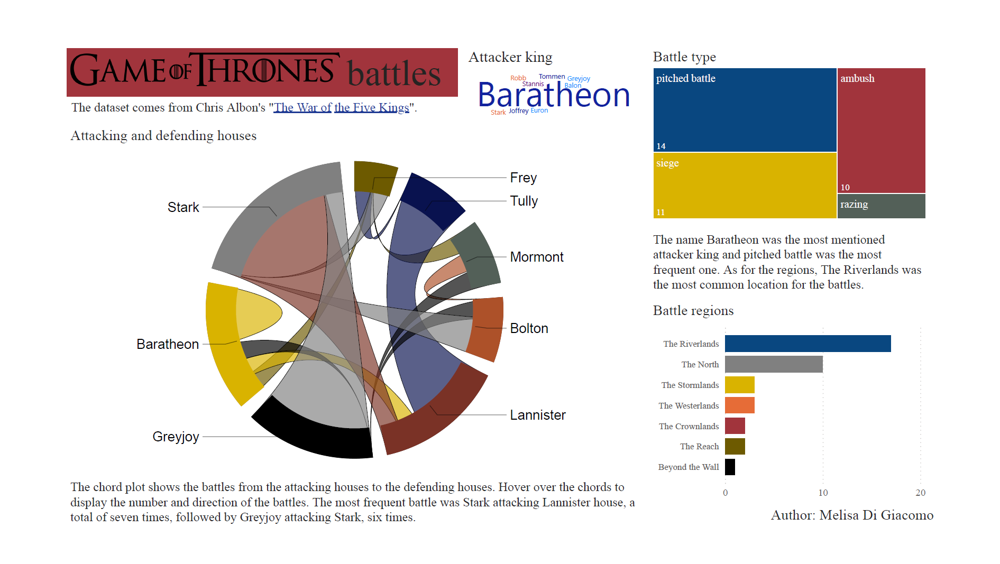
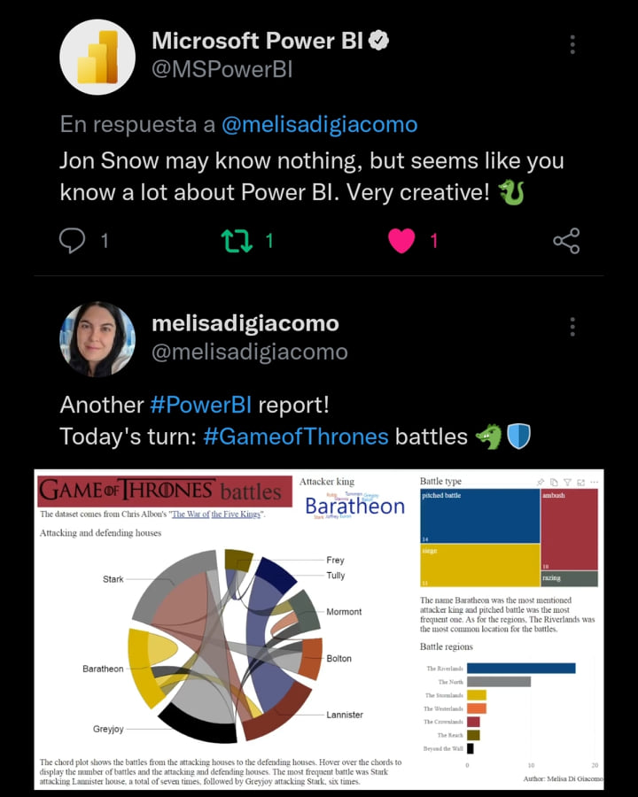
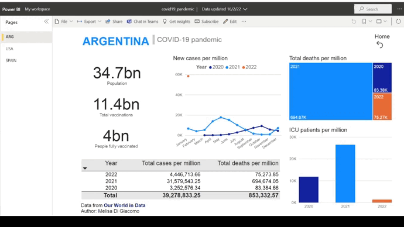
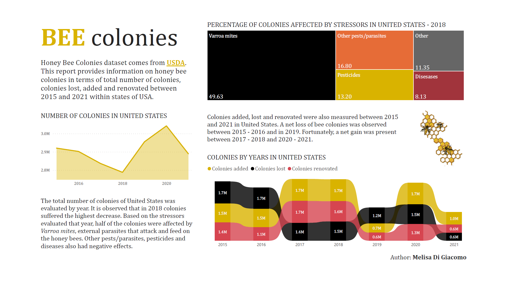

# PowerBI dashboards

In this repo I share my PowerBI reports on different topics.

## Code and Resources Used 
**PowerBI Version:** 2.100.1182.0  
**Datasets:** Game of Thrones battles, Covid-19 pandemic, bee colonies.

# Game of Thrones battles

This report analyzed Game of Thrones battles. The dataset was collected from [Chris Albon's "The War of the Five Kings"](https://github.com/chrisalbon/war_of_the_five_kings_dataset)

I loved [@MSPowerBI](https://twitter.com/MSPowerBI) response, LOL!

# Covid-19 pandemic

Covid-19 numbers in Argentina, United States and Spain were analyzed. The variables were: cases, deaths, ICU patients and vaccination.
The data came from [Our World in data](https://ourworldindata.org/coronavirus) and was collected from January 1, 2020 until January 29, 2022.  

# Bee colonies

This dashboard provides information on honey bee colonies in terms of total number of colonies, colonies lost, added and renovated between 2015 and 2021 within states of USA. The dataset came from [USDA](https://usda.library.cornell.edu/concern/publications/rn301137d?locale=en).

