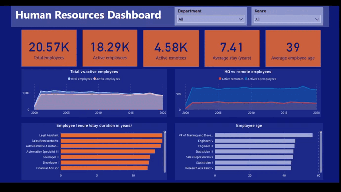
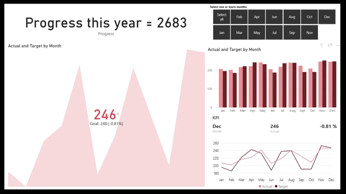
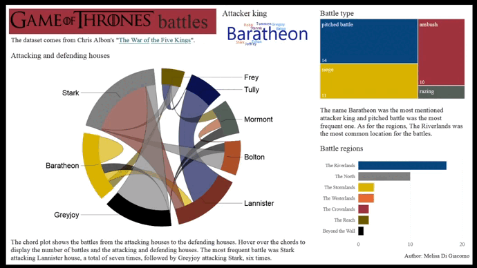

# PowerBI dashboards

In this repo I share my PowerBI reports on different topics.

## Code and Resources Used 
**PowerBI Version:** 2.100.1182.0  
**Datasets:** Human resources, sales KPI, Game of Thrones battles, Covid-19 pandemic, bee colonies.

# Human resources dashboard

LINK: [HR dashboard](https://app.powerbi.com/groups/me/reports/d39ca1c9-44d3-4318-a935-071725664c16/ReportSection)

I created a Human Resources dashboard that provides insights into various aspects of the employees in the company. The dashboard provides information about the total number of employees, active employees, remote employees, average employee tenure (in years), and average employee age. Total and active employees are plotted over time to give a visual representation of the changes in the workforce.

Additionally, I analyzed the distribution of employees working in the headquarters or remote  among the active employees and looked into the employee tenure and age in different job roles. To make the dashboard more user-friendly and customizable, I added two filters - company department and gender - which allow users to view the data based on their preferences.

This dashboard provides valuable insights into the workforce of the company, which can help with decision-making and planning for the future.

# Sales KPI dashboard

LINK: [Sales KPI dashboard](https://app.powerbi.com/groups/me/reports/be7c96a5-65da-434a-8992-bae65f5f4dbb/ReportSection)

This dashboard is a KPI analysis of actual versus target that can be a useful tool for evaluating the performance of a company.  

- Actual: sales of last year period.  
- Target: sales for the same period, based on historical sales figures.

Here the difference between actual and target sales were analyzed by month. This gives an indication of whether or not the sales target was met. If the actual sales numbers are higher than the target, the sales team has exceeded expectations. If the actual sales numbers are lower than the target, the sales team will need to improve their performance. 

By comparing actual sales numbers over time, it is possible to analyze any trends and determine if the sales team is consistently meeting or exceeding its targets.

From the numbers obtained it is important to analyze the reasons for the difference. Some possible reasons could include changes in market conditions, competition, problems with the product, or the performance of the sales team.

Finally, it might be necessary to develop an action plan to improve sales performance. This could involve adjusting the sales target, improving the sales process, or providing additional training to the sales team.

# Game of Thrones battles

LINK: [GoT dashboard](https://app.powerbi.com/groups/me/reports/4294451a-e4db-4a8a-b8b0-e23cd30ba3a4/ReportSection)

This report analyzed Game of Thrones battles. The dataset was collected from [Chris Albon's "The War of the Five Kings"](https://github.com/chrisalbon/war_of_the_five_kings_dataset).  
The chord diagram shows the number of battles between houses. The attacking and defending houses are shown on the chords. The attacker kings, battle types and regions are also observed.

I loved [@MSPowerBI](https://twitter.com/MSPowerBI) response, LOL!

# Covid-19 pandemic

LINK: [Covid-19 dashboard](https://app.powerbi.com/groups/me/reports/dc9c118e-f200-4786-adae-cdb262ee92dc/ReportSection)

Covid-19 numbers in Argentina, United States and Spain were analyzed. The variables were: cases, deaths, ICU patients and vaccination.
The data came from [Our World in data](https://ourworldindata.org/coronavirus) and was collected from January 1, 2020 until January 29, 2022.  

# Bee colonies

LINK: [Bee colonies dashboard](https://app.powerbi.com/groups/me/reports/4dd447bc-1393-415c-bd6f-1d6cd917e4eb/ReportSection)

This dashboard provides information on honey bee colonies in terms of total number of colonies, colonies lost, added and renovated between 2015 and 2021 within states of USA. The dataset came from [USDA](https://usda.library.cornell.edu/concern/publications/rn301137d?locale=en).

